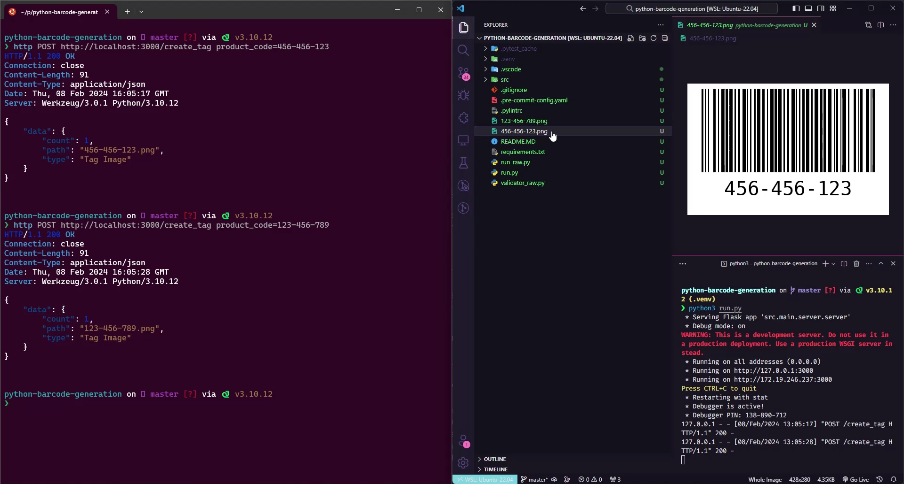

# Barcode generation - Logistics label generator for e-commerces 🏷️

<br>

<p align="center">
  <a href="#-about-the-project">About the project</a> •
  <a href="#-technologies">Technologies</a> •
<a href="#-getting-started">Getting started</a> •
<a href="#-license">License</a>

</p>

<p align="center">

  
 
  
</p>

## 👩‍💻 About the project

This Python project focuses on logistics and aims to create a web service that enables the generation of barcodes from product codes provided by POST requests.

This solution is highly applicable in inventory management systems, allowing for the dynamic generation of labels for new products. Through this tool, users can streamline processes for identifying and tracking items in their inventories.

Despite its apparent simplicity, the project is built with rigor and follows best practices in software architecture, aligning with the demands of the job market for Python development, including unit testing.

## 🚀 Technologies

- Flask
- virtualenv
- Pytest
- Cerberus
- Python-barcode
- Pillow

## 💻 Getting started

### Requirements

- [Python 3+](https://www.python.org/)
- [Pip](https://pypi.org/project/pip/)

**Clone the project and access the folder**

```bash
$ git clone https://github.com/leandrorodrigues00/python-barcode-generation && cd python-barcode-generation

```

**Follow the steps below (Unix)**

```bash
# Creating virtual environments
$ python3 -m venv .ven

# Command to activate virtual environment
$ .venv/bin/activate.fish

# Start the server
$ python3 run.py
```

## 📝 License

This project is licensed under the MIT License - see the [LICENSE](LICENSE) file for details.

---

<p align="center">
  Made with 💜&nbsp; by  Leandro Rodrigues
</p>
